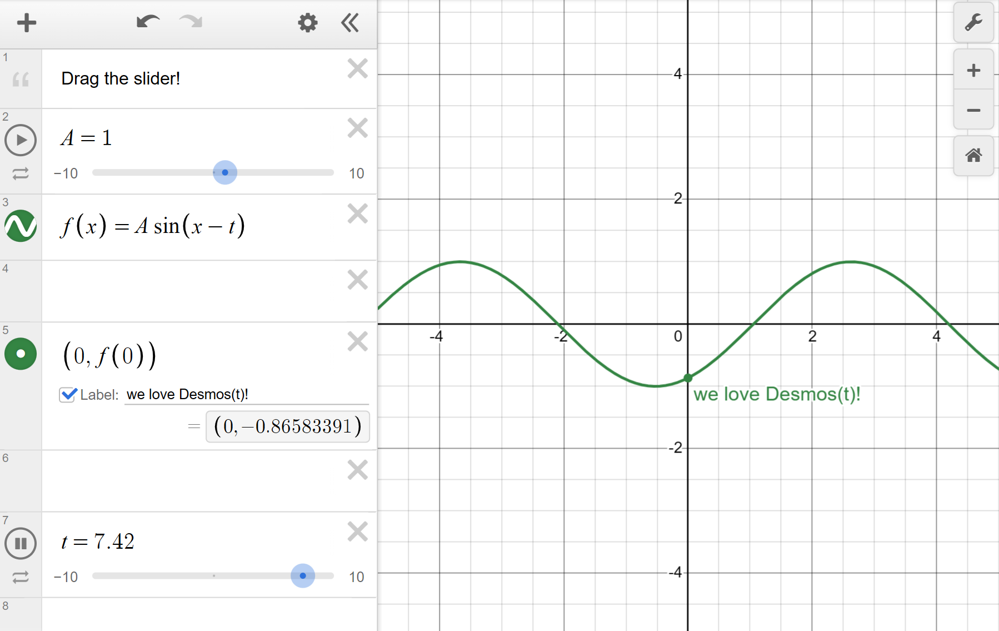

<div align="center">

# Desmost

[**Docs**](docs/)&ensp;·&ensp;[**Learn X in Y**](docs/writing/learn-x-in-y.md)&ensp;·&ensp;[**Changelog**](CHANGELOG.md)&ensp;·&ensp;[**Spec**](docs/spec/)&ensp;·&ensp;[**Playground**](https://sup2point0.github.io/desmost)

[](https://www.npmjs.com/package/desmost)
[](https://github.com/Sup2point0/desmost/actions/workflows/test.yml)
[](https://github.com/Sup2point0/desmost/actions/workflows/deploy.yml)

</div>

***Desmost*** compiles LaTeX into Desmos.

<table>
  <tr></tr>
  <tr>
    <th> You write this: </th>
    <th> and Desmost gives you this: </th>
  </tr>
  <tr>
    <td>
      <pre lang="hs"><code>
/viewport{left: -5, right: 5}
<br>
% Drag the slider!
A = 1
f(x) = A \sin(x-t)
<br>
/label{
  text: "we love Desmos(t)!"
} :: (0, f(0))
<br>
/anim
/slider{min: -10, max: 10}
  :: t = 0
</code></pre>
    </td>
    <td>
      <a href="https://sup2point0.github.io/desmost">
        
      </a>
    </td>
  </tr>
</table>

In other words, it’s like HTML+CSS but for Desmos. Write your content in LaTeX (alongside your Markdown!) with Desmost syntax where you need it, and Desmost will turn it into a Desmos calculator embed for you.


<br>


## Usage

> [!Important]
> Desmost only works **in the browser**. This is because it relies on the [Desmos API](https://www.desmos.com/api/v1.12/docs/index.html), which (currently) can only be included via `<script>`.

### Install
```bash
npm install desmost
```

### Write
See [Docs / Writing](docs/writing) to learn how to use Desmost syntax on top of LaTeX.

### Compile
```ts
import { compile } from "desmost";

let calc = Desmos.GraphingCalculator(...);
compile(calc, "f(x) = x^2");
```

Pass in [options](docs/compiling/compiler-options.md) to customise compilation:

```ts
compile(calc, "/text{ sup world! }", {
  errors: "crash",
  ignore_blank_lines: true,
});
```

### Render
Left up to you, in your framework of choice!

But if you enjoy nice things, Desmost provides a [Svelte<sup>↗</sup>](https://svelte.dev) component for mass-compiling Desmost, intended to be used in conjunction with [MDsveX<sup>↗</sup>](https://mdsvex.pngwn.io/):

```svelte
<script>
  import Content from "./intro.md";
  import { Desmost } from "desmost/svelte";
</script>

<Desmost>
  <Content />
</Desmost>
```

This will replace all ` ```desmos ` blocks from your Markdown source with Desmos calculator embeds.


<br>


## Features

> [!Tip]
> This is a brief look at what Desmost can do, and why you might want to use it. For full guidance, please head to [Docs](docs/)!

### Simple
Desmost aims to be as lightweight as possible. If all you need is a blocks of LaTeX with no extra customisation, then **that’s all you need to write**.

```hs
a = 2
b = 3
c = 5

y = ax^2 + bx + c
```

If you want to add Desmos notes, just leave a `%` LaTeX comment:

```hs
% Welcome to Desmost!

a = 2
b = 3
c = 5

y = ax^2 + bx + c
```

### Intuitive
But let’s say you want to do something fancier, like animating the slider for one of those variables.

All you need to do is add `/anim` in front of that line, plus a `::` delimiter:

```hs
% Welcome to Desmost!

/anim :: a = 2
b = 3
c = 5

y = ax^2 + bx + c
```

These are called [***incantations***](docs/writing/incantations.md), and it’s the only syntax there is in Desmost.[^tiny]

[^tiny]: Told you Desmost’s a tiny DSL!

When Desmost compiles this into Desmos, it’ll see `/anim` and know to set `playing: true` for that particular Desmos expression.

### Scalable
Suppose you also want to customise the slider bounds. Just add another incantation, this time with an argument:

```hs
% Welcome to Desmost!

/anim /slider{min: 0, max: 10} :: a = 2
b = 3
c = 5

y = ax^2 + bx + c
```

> [!Tip]
> Look familiar? Desmost’s incantation syntax mirrors LaTeX’s `\backslash{}` commands ;)

### Readable
This line is getting a little long, though. We can break it up over multiple lines:

```hs
% Welcome to Desmost!

/anim
/slider{min: 0, max: 10}
  :: a = 2
b = 3
c = 5

y = ax^2 + bx + c
```

### Multi-Line LaTeX
What if it’s not your incantations, but your LaTeX that’s becoming too long?

```latex
I = \int \frac{1 + x + x^2}{1 + x} \ dx
```

We’ve got an incantation for that – `/latex`:

```latex
/latex{
  I = \int \frac
      {1 + x + x^2}
      {1 + x}
    \ dx
}
```

And that’s all there is to Desmost!

All other functionality you might need is accessed through more incantations. For a complete list of all the available incantations, visit [Incantations Reference](docs/incantations-reference.md).

Enjoy!


<br>


## Rationale

### Made for Markdown
Desmost doesn’t have to be used for Markdown, but that’s what it was designed for.[^made-for-md] The key purpose of Desmost is to let you program Desmos embeds **with raw text** *alongside your prose*:

[^made-for-md]: I mean, if you aren’t using Desmost in Markdown, then you may as well just use the Desmos JavaScript API directly.

````md
# Mysteries of Sound

Today we’re investigating the beauty of soundwaves and Fourier transforms. This is a sine wave:

```desmos
y = \sin{x}
```

And here’s a saw wave:

```desmos
/viewport{left: -2*Math.PI, right: 2*Math.PI}

/slider{min: 1, max: 40, step: 1} :: N = 1
/latex{
  f(x) = \frac{2}{\pi} \sum_{n=0}^{N} \frac{
}

/anim-mono /slider{min: 0, max: "2\\pi"}
```
````

Exactly like how a ` ```math ` block renders into LaTeX, or a ` ```mermaid ` block renders a diagram.

### Keep the simple stuff simple
We want simple stuff like this to work effortlessly:

```latex
p = 2
q = 3
p + q
```

This keeps it easily comprehendable when mixed with Markdown. And it’s exactly the same as what you’d type into Desmos – it’s like you meant to do that, but accidentally ended up typing it into your IDE!

### Make the complex stuff possible
At the same time, we want to provide full control over as many aspects of the calculator as possible. Incantations make this easy – to access more functionality, all it takes is adding a new incantation.

### Mirror the Desmos API
All object arguments to incantations such as `/viewport{}` and `/slider{}` are identical to the Desmos API. This means fewer unnecessary abstractions for you to remember.

### Don’t parse LaTeX
Desmost only handles what it needs to care about to work. You don’t need a LaTeX parser, because Desmos will already do that later down the line – parsing it ourselves would just be wasted effort!


<br>


## Generative AI

<a href="https://brainmade.org">
  
</a>

Every bug, typo and inefficiency was lovingly crafted by hand <3


<br>
<br>
